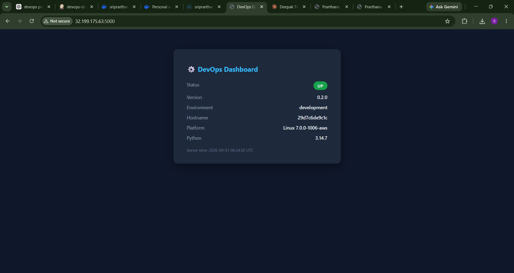
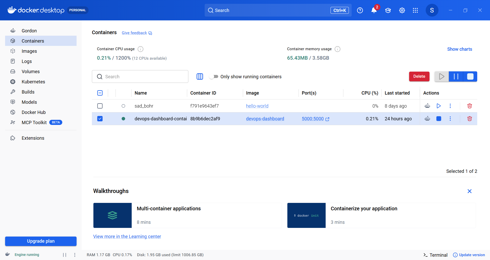
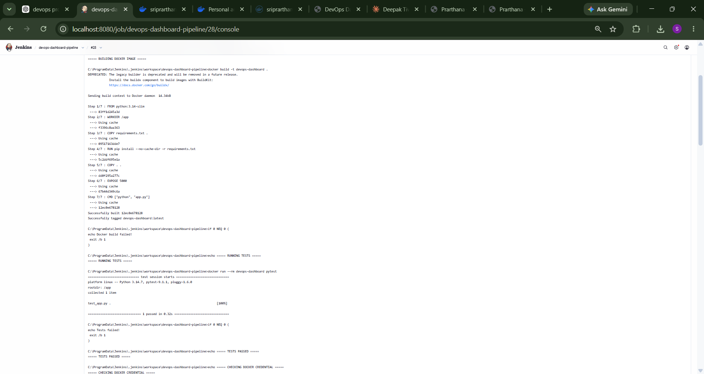
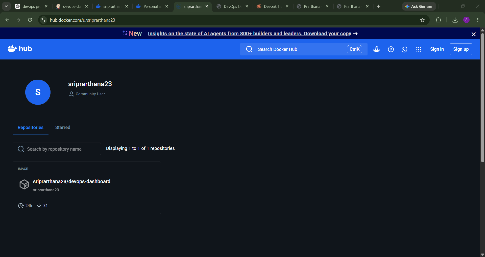
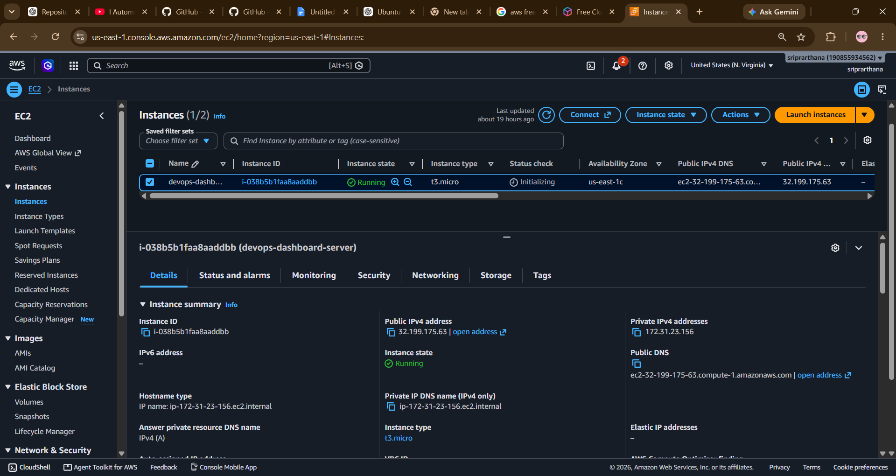
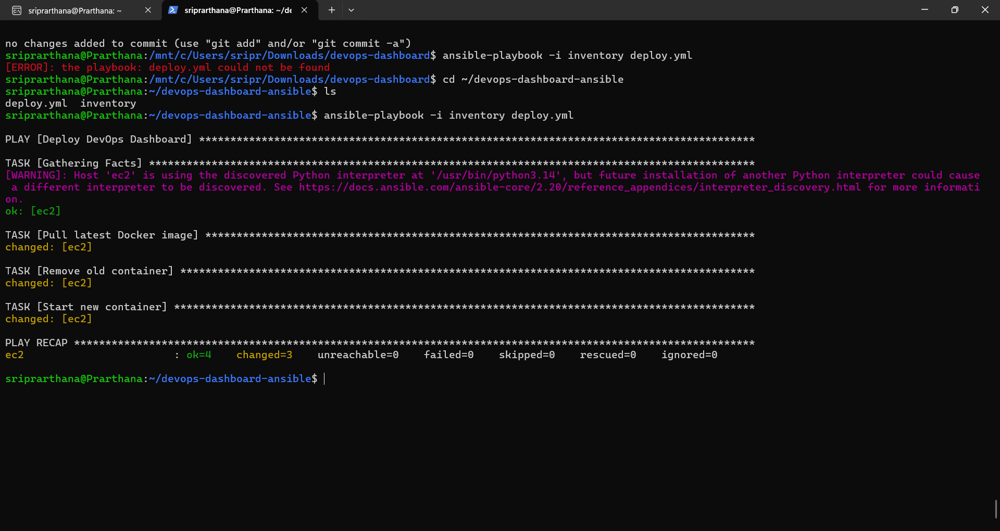
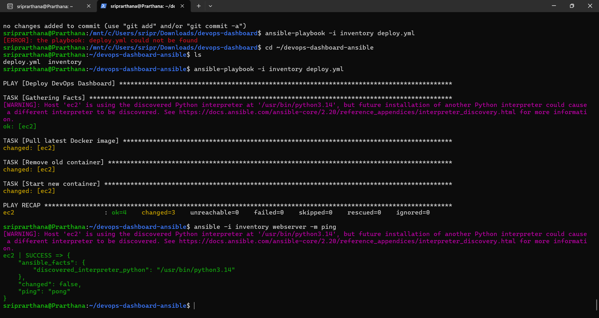
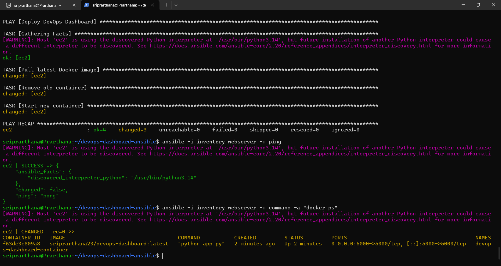

# DevOps Dashboard

A containerized Flask application demonstrating an end-to-end **Cloud & DevOps deployment workflow** using GitHub, Jenkins, Docker, Docker Hub, Ansible, and AWS EC2.

The project demonstrates how application code can move from **source control → automated testing → containerization → image publishing → infrastructure deployment → running application**.

## 🚀 DevOps Workflow

```text
Developer
    │
    ▼
GitHub
    │
    ▼
Jenkins CI/CD
    │
    ├── Checkout source code
    ├── Build Docker image
    ├── Run automated tests
    ├── Login to Docker Hub
    └── Push Docker image
            │
            ▼
       Docker Hub
            │
            ▼
         Ansible
            │
            ├── Pull latest image
            ├── Remove old container
            └── Start new container
                    │
                    ▼
                AWS EC2
                    │
                    ▼
            Running Container
                    │
                    ▼
             DevOps Dashboard
```

## 🛠️ Tech Stack

| Category                   | Technologies                       |
| -------------------------- | ---------------------------------- |
| Application                | Python, Flask                      |
| Version Control            | Git, GitHub                        |
| CI/CD                      | Jenkins                            |
| Containerization           | Docker                             |
| Container Registry         | Docker Hub                         |
| Configuration / Deployment | Ansible                            |
| Cloud                      | AWS EC2                            |
| Testing                    | Pytest                             |
| OS / Remote Server         | Ubuntu Linux                       |
| Automation                 | Jenkins Pipeline, Ansible Playbook |

## ✨ Features

* Flask-based DevOps dashboard
* Dockerized application
* Automated application testing with Pytest
* Jenkins CI/CD pipeline
* Docker image build and publishing
* Docker Hub container registry
* Automated deployment using Ansible
* Deployment to AWS EC2
* Environment-based application configuration
* Application health-check endpoint
* System information displayed on the dashboard
* Version information for deployment verification

## 🔄 CI/CD Pipeline

Every application update follows this workflow:

### 1. Source Control

Application source code is maintained in GitHub.

```text
Git Push
   ↓
GitHub Repository
```

### 2. Jenkins Build

Jenkins automatically:

* Checks out the latest source code
* Builds the Docker image
* Runs automated tests
* Authenticates with Docker Hub
* Tags the image
* Pushes the image to Docker Hub

```text
GitHub
   ↓
Jenkins
   ↓
Docker Build
   ↓
Pytest
   ↓
Docker Hub
```

### 3. Ansible Deployment

Ansible connects to the AWS EC2 instance over SSH and deploys the latest Docker image.

The deployment playbook:

1. Pulls the latest Docker image
2. Removes the previous container
3. Starts a new container
4. Exposes the application on port `5000`

```text
Docker Hub
     ↓
  Ansible
     ↓
 AWS EC2
     ↓
Docker Container
     ↓
Flask Application
```

## ☁️ AWS Deployment

The application is deployed on an **AWS EC2 Ubuntu server** running Docker.

The deployed container exposes:

```text
EC2:5000 → Docker Container:5000
```

The application can be accessed through the EC2 instance's public address when the appropriate security-group rule is configured.

## 🧪 Testing

Automated tests are included using Pytest.

The Jenkins pipeline executes the tests before publishing the Docker image.

Example:

```text
pytest
1 passed
```

This ensures that the application is tested before the deployment stage.

## 📊 Application Endpoints

| Endpoint    | Purpose                              |
| ----------- | ------------------------------------ |
| `/`         | Human-facing DevOps dashboard        |
| `/health`   | Application health check             |
| `/api/info` | Dashboard information in JSON format |

### Health Check

```text
GET /health
```

Example response:

```json
{
  "status": "healthy",
  "version": "0.2.0"
}
```

## ⚙️ Environment Variables

The application supports environment-based configuration.

| Variable      | Description                                | Default       |
| ------------- | ------------------------------------------ | ------------- |
| `APP_VERSION` | Application version displayed on dashboard | `0.1.0`       |
| `APP_ENV`     | Application environment                    | `development` |

Example:

```bash
export APP_VERSION=0.2.0
export APP_ENV=production
```

## 📁 Project Structure

```text
devops-dashboard/
│
├── app.py
├── test_app.py
├── requirements.txt
├── Dockerfile
├── .dockerignore
├── .gitignore
├── README.md
│
├── templates/
│   └── index.html
│
├── screenshots/
│   ├── 01-dashboard.png
│   ├── 02-docker-image.png
│   ├── 03-jenkins-build-tests.png
│   ├── 04-dockerhub.png
│   ├── 05-aws-ec2.png
│   ├── 06-ansible-deployment.png
│   ├── 07-ansible-ping.png
│   └── 08-ec2-container.png
│
└── ansible/
    ├── inventory.example
    └── deploy.yml
```

## 💻 Run Locally

Clone the repository:

```bash
git clone git@github.com:prarthana2301/devops-dashboard.git
cd devops-dashboard
```

Create a virtual environment:

```bash
python -m venv venv
```

Activate it:

### Linux / WSL

```bash
source venv/bin/activate
```

### Windows

```powershell
venv\Scripts\activate
```

Install dependencies:

```bash
pip install -r requirements.txt
```

Run the application:

```bash
python app.py
```

Open:

```text
http://localhost:5000
```

## 🐳 Run with Docker

Build the image:

```bash
docker build -t devops-dashboard .
```

Run the container:

```bash
docker run -d \
  --name devops-dashboard \
  -p 5000:5000 \
  devops-dashboard
```

Open:

```text
http://localhost:5000
```

## 🤖 Ansible Deployment

Configure the server details in a local inventory file based on:

```text
ansible/inventory.example
```

Then test connectivity:

```bash
ansible -i inventory webserver -m ping
```

Run the deployment:

```bash
ansible-playbook -i inventory deploy.yml
```

The inventory containing the real server IP and private-key path is intentionally excluded from Git using `.gitignore`.

## 📸 Project Screenshots

### 1. Running DevOps Dashboard



### 2. Docker Image



### 3. Jenkins CI/CD Build and Tests



### 4. Docker Hub



### 5. AWS EC2 Deployment



### 6. Ansible Deployment



### 7. Ansible Connectivity Test



### 8. Running Docker Container on EC2



## 🔐 Security

Sensitive credentials and infrastructure configuration are intentionally excluded from the repository.

The `.gitignore` prevents files such as:

```text
.env
*.pem
ansible/inventory
```

from being committed to GitHub.

The repository contains only the example Ansible inventory:

```text
ansible/inventory.example
```

No private SSH keys, passwords, or access tokens are stored in the repository.

## 🎯 What This Project Demonstrates

This project demonstrates practical experience with:

* Linux server administration
* Git and GitHub workflows
* Docker containerization
* CI/CD automation with Jenkins
* Automated testing
* Docker image management
* Container registries
* AWS EC2 deployment
* SSH-based remote administration
* Ansible automation
* Infrastructure deployment workflows
* Environment-based configuration
* Basic application health monitoring concepts

## 🔮 Future Improvements

Planned improvements include:

* Prometheus metrics
* Grafana dashboards
* Kubernetes deployment
* Terraform-based AWS infrastructure
* Automated infrastructure provisioning
* Advanced monitoring and alerting
* Production-grade CI/CD improvements

---

## 👩‍💻 Author

**Sriprarthana K**

MCA | Cloud & DevOps Enthusiast

GitHub: [@prarthana2301](https://github.com/prarthana2301)

---

⭐ If you found this project useful, consider giving it a star!

